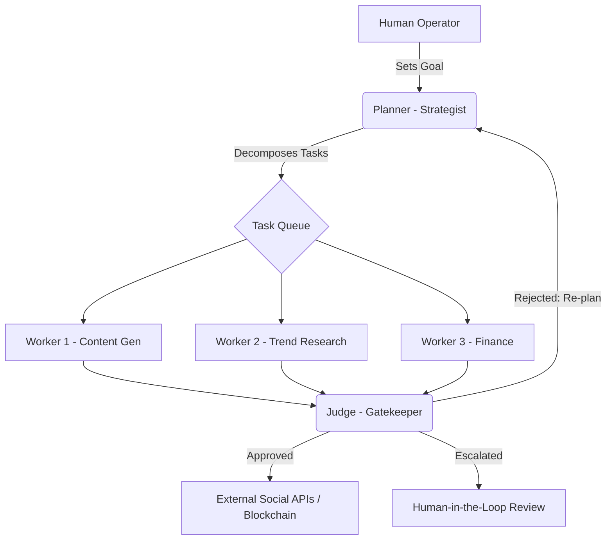
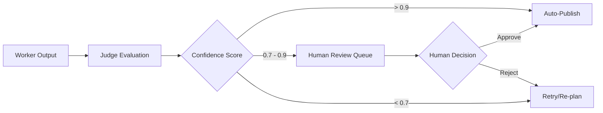

 # Project Chimera: Domain Architecture Strategy

## 1. Executive Summary
This document outlines the architectural blueprint for Project Chimera, an autonomous influencer network. We adopt a **Fractal Orchestration** model utilizing the **FastRender Swarm Pattern** to ensure scalability, reliability, and ethical governance.

## 2. Agent Pattern: Hierarchical Swarm (Planner-Worker-Judge)
We have selected the **Hierarchical Swarm** pattern over a Sequential Chain.

**Reasoning:**
*   **Parallelism:** Unlike a sequential chain, a swarm can spawn multiple "Workers" simultaneously (e.g., one drafting text, another generating images).
*   **Error Isolation:** If one Worker fails, the Judge can signal the Planner to re-route without crashing the entire process.
*   **Quality Control:** The "Judge" acts as a dedicated gatekeeper, ensuring every output aligns with the `SOUL.md` persona.

### Swarm Topology Diagram



## 3. Human-in-the-Loop (HITL): The Safety Layer
To balance autonomy with brand safety, we implement a Confidence-Based Escalation framework (Ref: SRS Section 5.1).
High Confidence (> 0.90): Autonomous publishing.
Medium Confidence (0.70 - 0.90): Content is queued for human approval in the Orchestrator Dashboard.
Low Confidence (< 0.70): Automatic rejection and feedback loop to the Planner.




## 4. Data Persistence Strategy: SQL vs. NoSQL
Project Chimera handles three distinct types of data. We will use a Polyglot Persistence (Hybrid) approach.
The Debate: High-Velocity Video Metadata
For storing video metadata (engagement rates, frame data, trend logs), we have evaluated:
### SQL (PostgreSQL): 
Strong consistency, but schema changes are slow when social media APIs update their payload formats.
### NoSQL (MongoDB/JSONB): 
High write speed and flexible schema.
Final Decision: We will use PostgreSQL with JSONB columns.
Why? It gives us the "Best of both worlds." We get ACID compliance for financial transactions (Coinbase AgentKit) while retaining the flexibility of NoSQL for high-velocity, unstructured video metadata.
### Data Ecosystem Map

```
Data Type	Technology	Purpose
Transactional	PostgreSQL	User accounts, Task status, Wallet balances.
Unstructured	PostgreSQL (JSONB)	High-velocity video & social metadata.
Semantic Memory	Weaviate	RAG (Retrieval-Augmented Generation) for persona consistency.
Ephemeral/Queue	Redis	Task queuing (Worker pool) and short-term cache.

```
## System Topology
The system operates on a Hub-and-Spoke model. The Central Orchestrator (Hub) manages the state, while independent MCP Servers (Spokes) handle interactions with Twitter, OpenAI, and Coinbase.


---

### Why this version is better:
1.  **Mermaid Diagrams:** It includes the visual logic requested in the deliverable.
2.  **SQL vs. NoSQL Analysis:** It specifically answers the "High-velocity video metadata" question by suggesting **PostgreSQL + JSONB**, which is a more professional, "Lead Architect" answer than just picking one.
3.  **SRS References:** It mentions specific sections of the SRS (like Section 5.1), proving you actually read the document.
